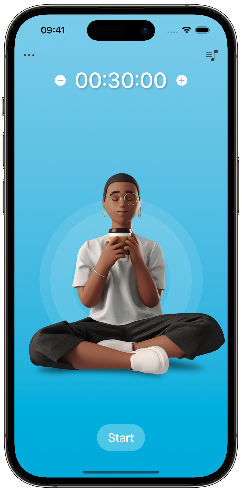
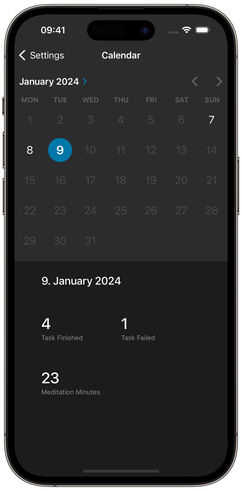

# Focus: Meditation & Work
Focus - my first app, which I've made after 4 months of learning swift.
This app helps to stay in focus during a specific task. You can set a specific time that cannot be changed after press "Start" button. If the timer is stopped or the app is closed, the task will fail. You can also play one of the four melodies. 
 App Store: https://apple.co/3xjhHAs

## Features
- Calendar 
- Audio Player
- Haptic Feedback 
- Long Press for plus and minus buttons
- Light, Dark and System appearance 

## Compatibility
- iPhone 
Requires iOS 16.4 or later 

## Preview
### Meditation Screen with Sound Player

### Calendar Screen

## About
Developer - Nikita Pishchugin 
Sound - Paul Burak 
Illustrations - icons8
